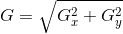

# sobel-filter
Implement the sobel filter using CUDA and C++

# Sobel Filter

# Build
Install OpenCV library and Boost library and then use Makefile

`$ make`

# Demo

# References
[Opencv 3.2.0 doc - Sobel Derivatives](https://docs.opencv.org/3.2.0/d2/d2c/tutorial_sobel_derivatives.html)

[Wikipedia - Sobel operator](https://en.wikipedia.org/wiki/Sobel_operator)

# License
BSD-2-Clause